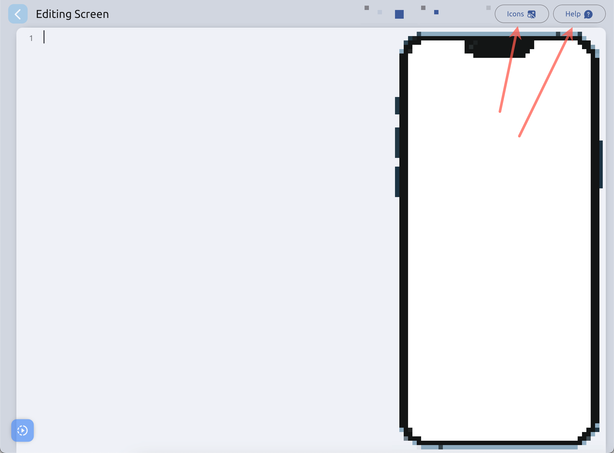
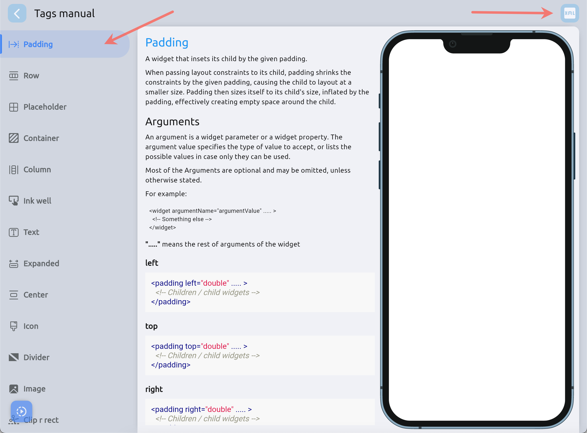

# Built In Help

Nanc has built-in help for some aspects. The icons section [mentioned](./packages/icons#utils) a menu that allows you to search for icons available in Nanc and easily select them.

Also, extended help is available for the Screen Field - the field responsible for the Backend Driven UI.
For example - you can access the documentation of all implemented widgets and their parameters available for building your interface, with interactive examples. There you can also access the menu with icons to quickly use them in your interface.

