# Firebase API

## Installing

```yaml
dependencies:
  nanc_api_firebase:
    path: ../nanc/nanc_api_firebase
```

## Configuring

### Creating Firebase Project

First, you need to create a Firebase project. If you want to use Nanc with an existing project, you can skip this section. Also, the official [documentation](https://pub.dev/packages/cloud_firestore) from Google will be the best instruction for actions. However, here we will show you the way to create a new Firebase project too.

#### Create new project

Go to [Firebase Console](https://console.firebase.google.com/) and click on **Add project** button

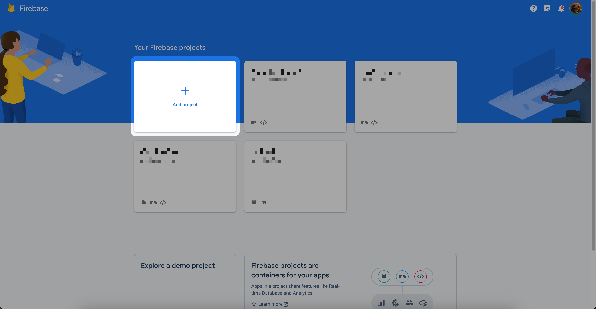

Type your project name


Enable or disable Google Analytics


Wait while project will be created


#### Create Firestore Database

Build Firestore Database

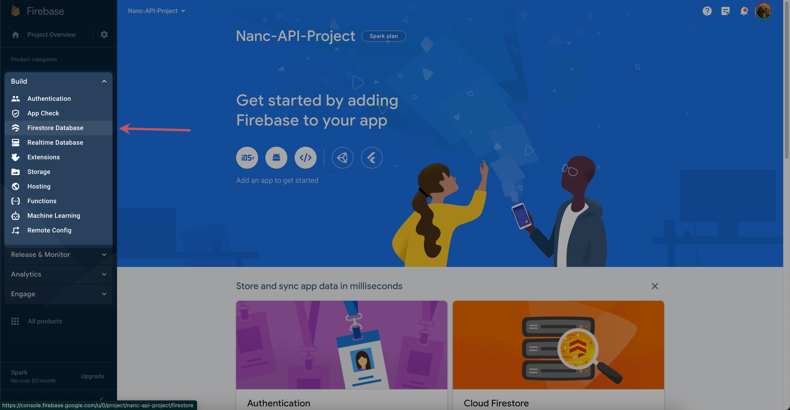
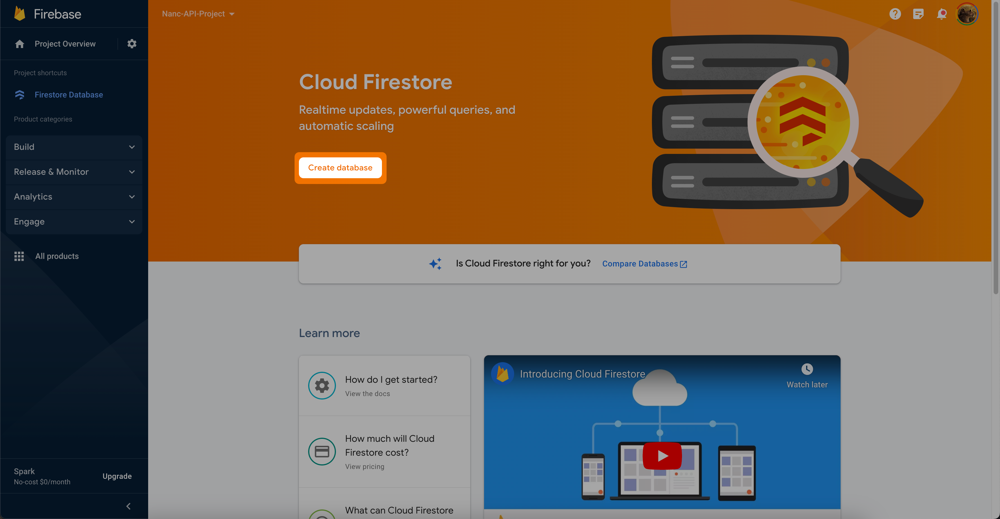
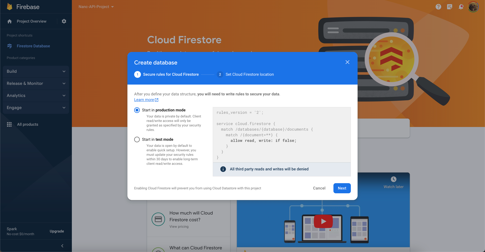
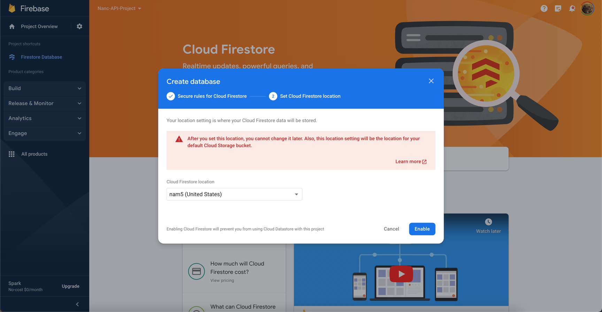
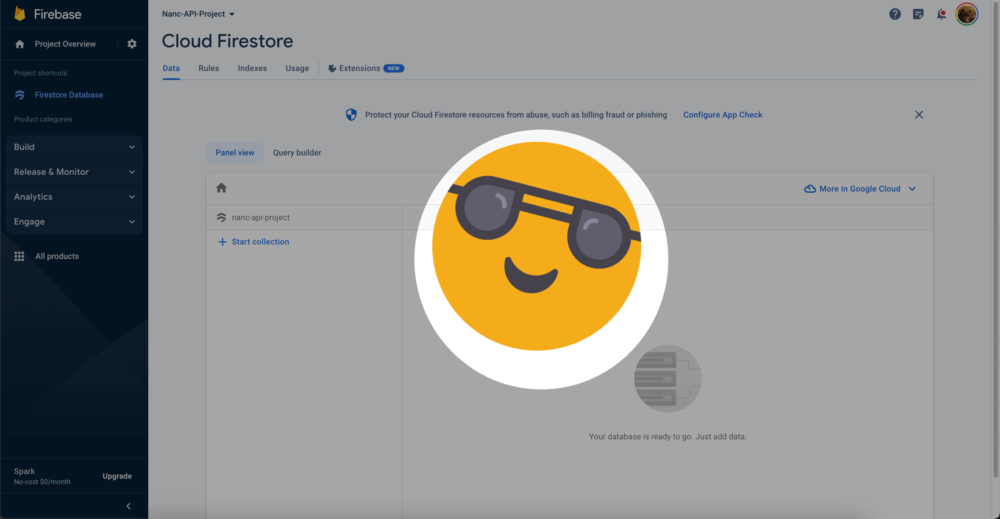

## Get Firebase Service Key

Go to the project settings

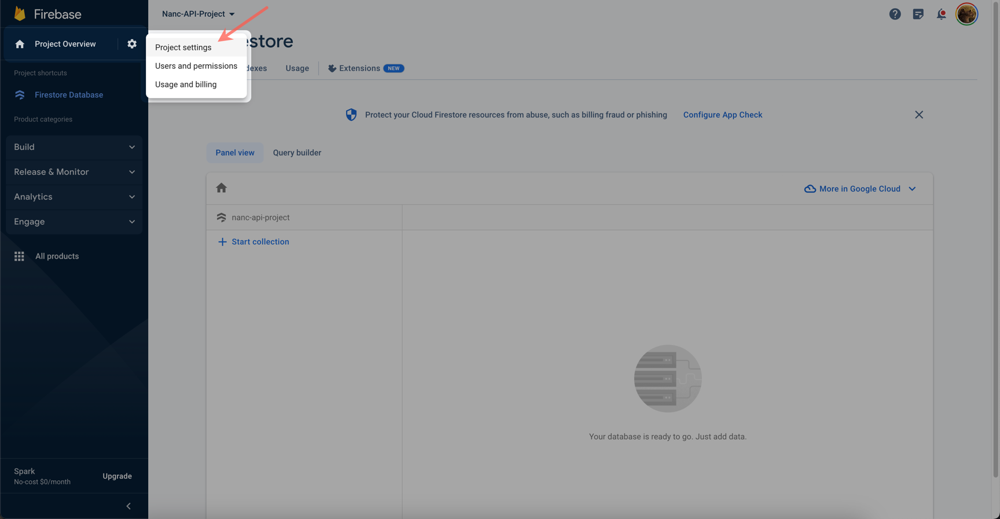

Then you need to go to the service accounts settings, to create service account and generate its access key

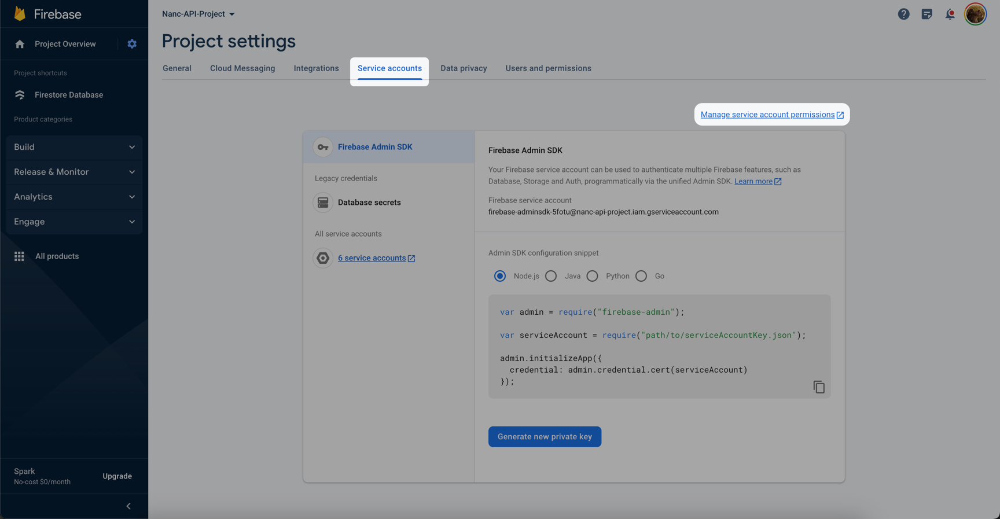
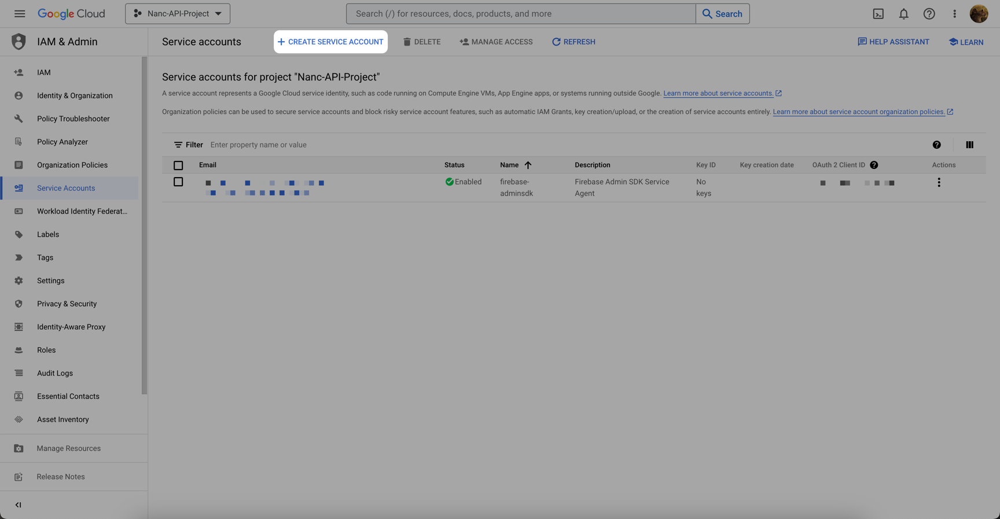

Type any name of your new service account

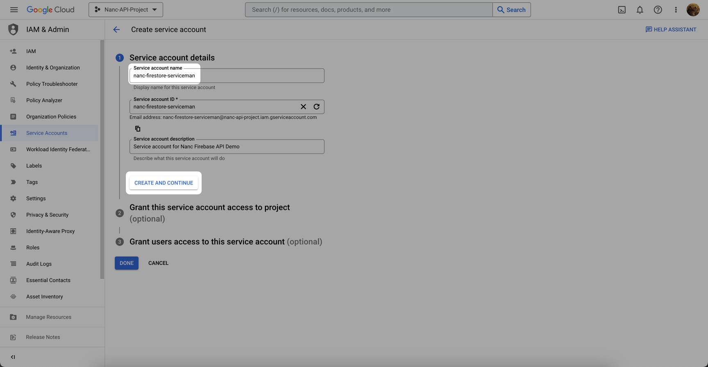

Select account role

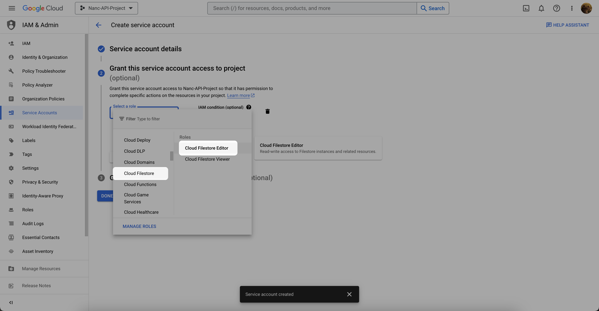

Finish account creation


Open newly created account settings

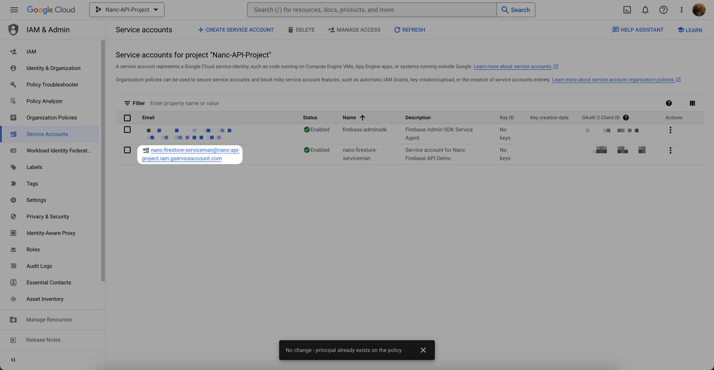

Add key to the service account

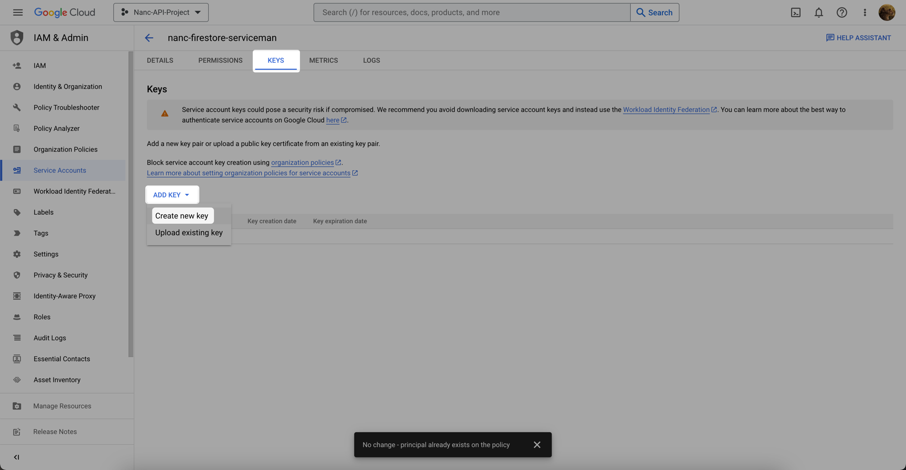

Create JSON key and then save it somewhere at your computer, for example - at the root, of your Nanc-CMS build project.

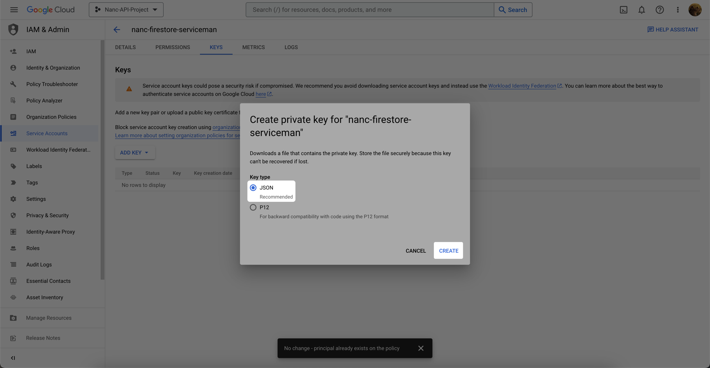

Разрешения у созданного сервисного аккаунта - недостаточные. Нужно пересоздать новый аккаунт с полными разрешениями.

## Using

