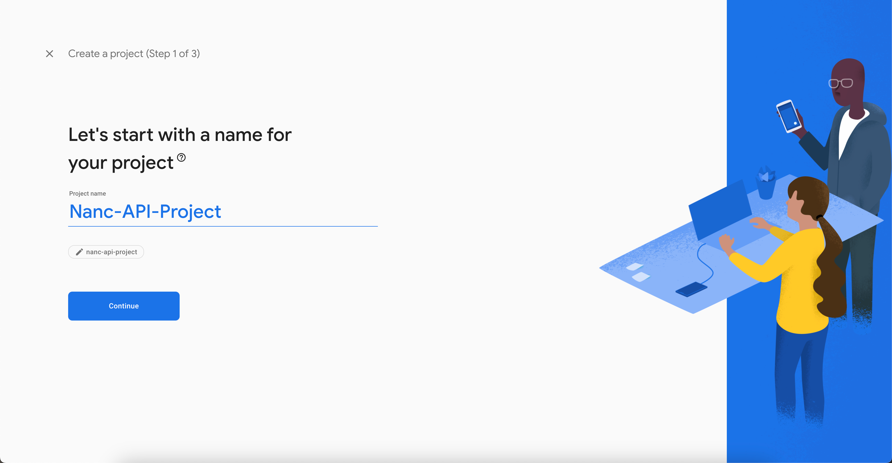
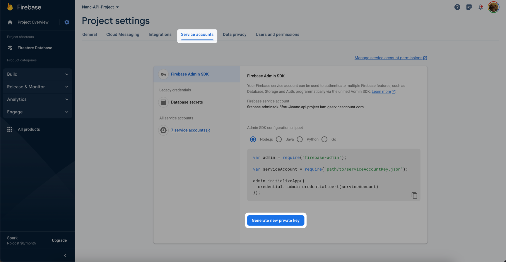

# Firebase API

:::danger
Working with Firestore Database implies the use of a service account. This account will have full access to read and modify data in your database. Be very careful where you deploy your Nanc build - if third-party users can get into it - they will be able to find out and change your data. **Your security is on your shoulders.**
:::

:::note
In the future, instructions on how to customize Nanc's built-in functionality will appear here, allowing potentially dangerous Nanc builds to be published to the public.
:::

## Installing

```yaml
dependencies:
  nanc_api_firebase:
    path: ../nanc/nanc_api_firebase
```

## Configuring

### Creating Firebase Project

First, you need to create a Firebase project. If you want to use Nanc with an existing project, you can skip this section and [go to the key generation one](#get-firebase-service-key). Also, the official [documentation](https://pub.dev/packages/cloud_firestore) from Google will be the best instruction for actions. However, here we will show you the way to create a new Firebase project too.

#### Create new project

Go to [Firebase Console](https://console.firebase.google.com/) and click on **Add project** button


Type your project name



Enable or disable Google Analytics


Wait while project will be created


#### Create Firestore Database

Build Firestore Database


## Get Firebase Service Key

Go to the project settings


Then you need to go to the service accounts settings, to create service account and generate its access key



And generate the key


Then save it somewhere at your computer, for example - at the root, of your Nanc-CMS build project.

## Using

So you have a database and a JSON key to access it. Now you can create the required API instances to start using Firestore as a backend. The following code will shed some light on how you can implement this:

```dart
import 'dart:async';

import 'package:cms/cms.dart';
import 'package:config/config.dart';
import 'package:flutter/material.dart';
import 'package:nanc_api_firebase/nanc_api_firebase.dart';

import 'firebase_key.dart';

Future<void> main() async {
  await runZonedGuarded(() async {
    WidgetsFlutterBinding.ensureInitialized();

    /// ? Creating instances of needed APIs
    final FirebaseApi firebaseApi = await FirebaseApi.create(firebaseBase64EncodedKey);

    /// ? Backend-first ICollectionApi implementation
    final FirebaseCollectionApi firebaseCollectionApi = FirebaseCollectionApi(api: firebaseApi);

    /// ? Partially-local ICollectionApi implementation
    final FirebaseLocalCollectionApi firebaseLocalCollectionApi = FirebaseLocalCollectionApi(api: firebaseApi);
    
    final FirebasePageApi firebasePageApi = FirebasePageApi(api: firebaseApi, firebaseCollectionApi: firebaseCollectionApi);
    final FirebaseModelApi firebaseModelApi = FirebaseModelApi();

    await adminRunner(
      CmsConfig(
        /// ? Use them here
        collectionApi: firebaseCollectionApi,
        pageApi: firebasePageApi,
        modelApi: firebaseModelApi,
        networkConfig: NetworkConfig.simple(),
        imageBuilderDelegate: null,
        adminWrapperBuilder: null,
        predefinedModels: [
          /// ? Here will be a list of your predefined code-first models
        ],
        customRenderers: [],
        clickHandlers: [],
        customFonts: [],
      ),
    );
  }, ErrorsCatcher.catchZoneErrors);
}
```

The `firebaseBase64EncodedKey` variable holds the Base64-encoded contents of the JSON key downloaded in the previous step. This is the format in which the `FirebaseApi.create` constructor accepts the key from the Firestore service account.

Also, you might have noticed that there are two `ICollectionApi` implementations declared in the code - `FirebaseCollectionApi` and `FirebaseLocalCollectionApi`. Let's dwell on their differences a bit more.

## Backend-first Collection Api

`FirebaseCollectionApi` - is an implementation of working with collections throught Firestore, which implies constant use of Firestore Database - any filtering, searching, pagination operations will be performed through a new call to the server. Also, the logic of data filtering and searching is implemented in full compliance with the capabilities of Firestore itself. And these capabilities are very limited. For example - you will not be able to find any document by partial coincidence of one of the fields of the document with the value you entered. Say - "find all movies whose title begins with the substring `Appo`". Also, filtering by multiple fields is very limited due to the architecture of Firestore itself, so with this API implementation you are limited in the complexity of filter combinations, and in addition, some filter variations will require you to create special Firestore indexes. However, the latter is not a big deal - just pay attention to the error notifications that may appear in the lower left corner. If you see such a message when trying to find something - from the detailed information in this message you will be able to follow the link straight to the Firestore index creation window, where you will have to click just one button. Let's take a look at what this might look like in real life: