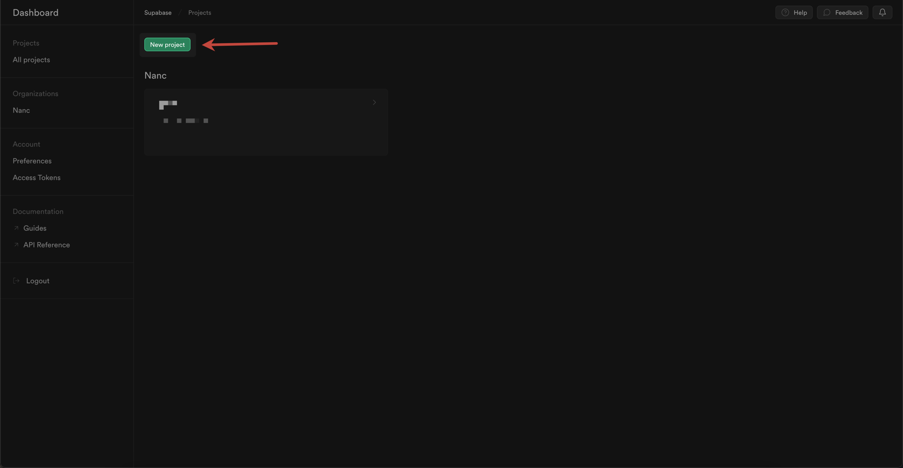
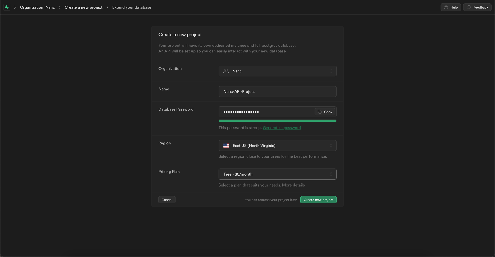
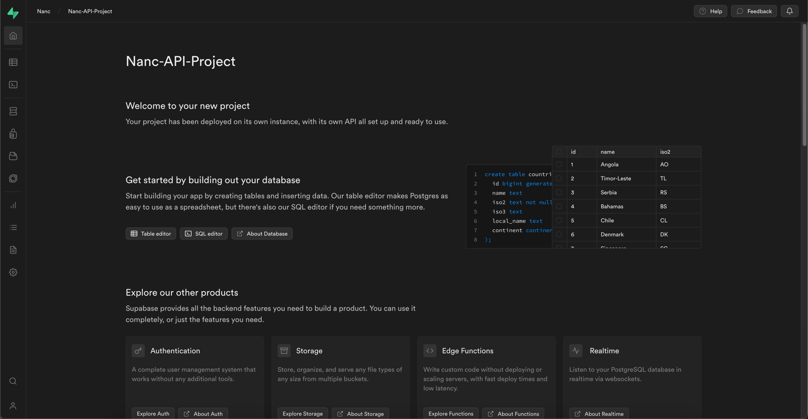
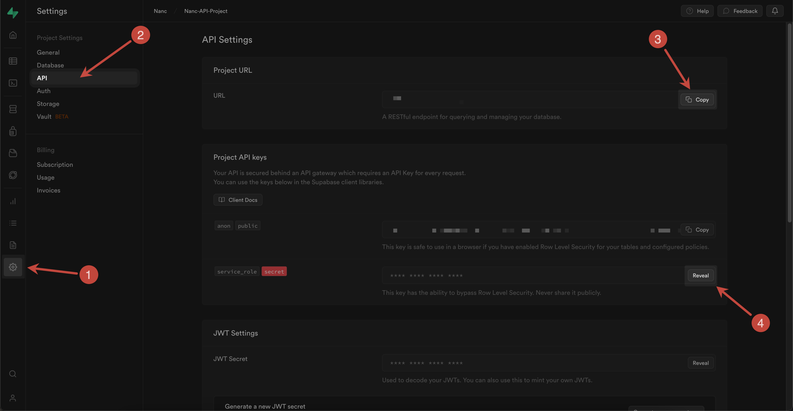
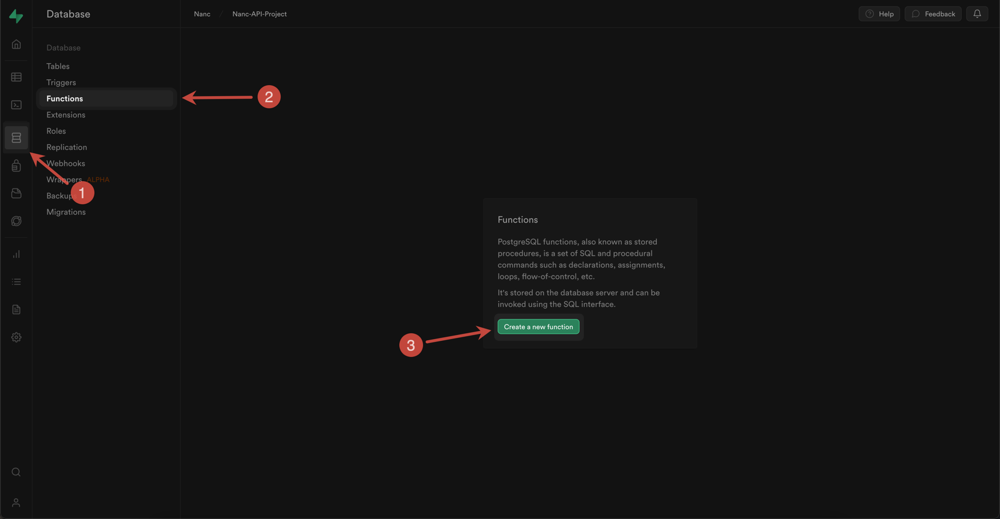
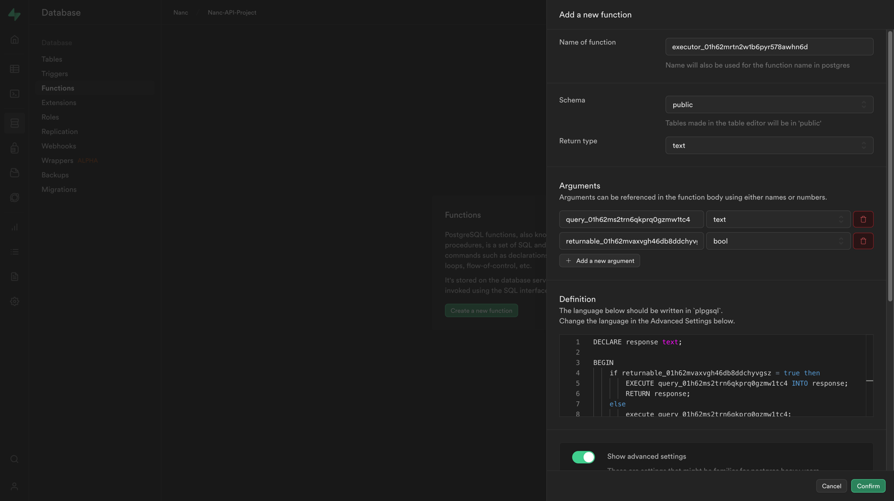
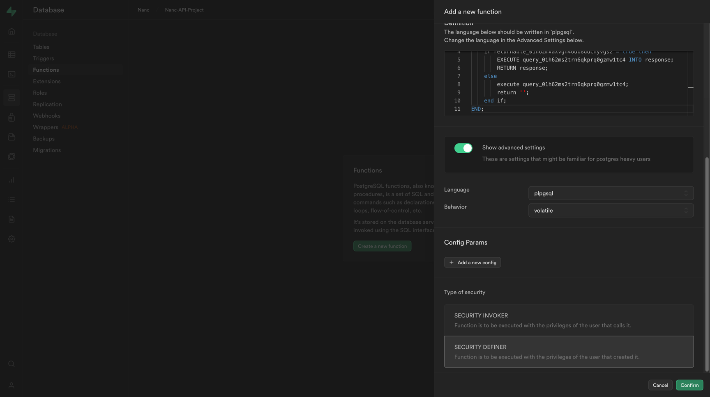
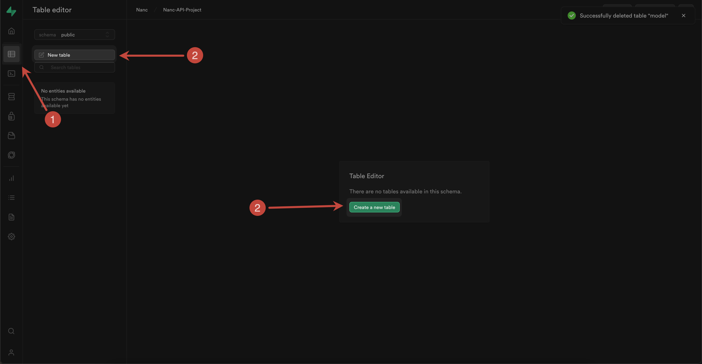
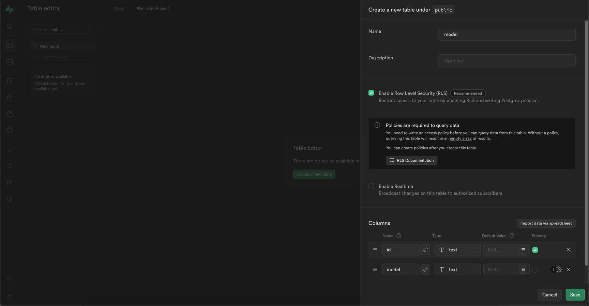
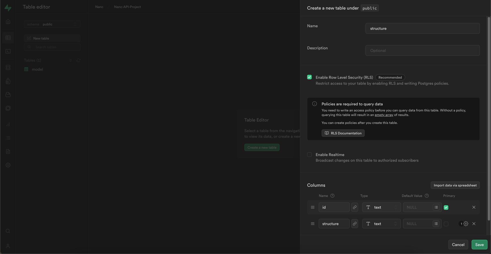

# Supabase api

## Installing

```yaml
dependencies:
  nanc_api_supabase:
    path: ../nanc/nanc_api_supabase
```

## Creating new Supabase project

First, you need to create a Supabase project. If you want to use Nanc with an existing project, you can skip this section and [go to the key getting section](#get-supabase-key-and-url). Also, the official [documentation](https://supabase.com/) from Supabase will be the best instruction for actions. However, here we will show you the way to create a new Supabase project too.

Go to [Supabase Dashboard](https://supabase.com/dashboard/projects), sign up / or sign in, and create a new project:



Fill your project name and database password:



Wait, until your new project's database will be created and you will see your project's initial screen:



## Get Supabase key and url

:::info
Any configuration parameter, be it a key, url or anything else, is used only inside the loop of your Nanc build and the service for which you are applying the configuration. We do not store or receive any of your data. At all.
:::

To organize work of Nanc with Supabase as a data provider, it is necessary to use service key (so that you can both read and write data and create new tables).

Also, in general for work with Supabase it is necessary to use project url.

The screenshot below shows how to get both url and service key:



## Using

So you have a database and a url with key to access it. Now you can create the required API instances to start using Supabase as a backend. The following code will shed some light on how you can implement this:

```dart
import 'dart:async';

import 'package:nanc/nanc.dart';
import 'package:config/config.dart';
import 'package:flutter/material.dart';
import 'package:nanc_model/nanc_model.dart';
import 'package:nanc_api_supabase/nanc_api_supabase.dart';

import 'models/age_rating_model.dart';
import 'models/country_model.dart';
import 'models/genre_model.dart';
import 'models/language_model.dart';
import 'models/movie_actor_relation_model.dart';
import 'models/movie_country_relation.dart';
import 'models/movie_director_relation_model.dart';
import 'models/movie_genre_relation.dart';
import 'models/movie_language_relation.dart';
import 'models/movie_model.dart';
import 'models/movie_quality_rating_relation.dart';
import 'models/movie_writer_relation_model.dart';
import 'models/person_model.dart';
import 'models/quality_rating_model.dart';
import 'supabase_key.dart';

Future<void> main() async {
  await runZonedGuarded(() async {
    WidgetsFlutterBinding.ensureInitialized();

    final SupabaseApi supabaseApi = await SupabaseApi.create(supabaseUrl: supabaseUrl, supabaseKey: supabaseServiceKey);
    final SupabaseCollectionApi supabaseCollectionApi = SupabaseCollectionApi(api: supabaseApi);
    final SupabaseDocumentApi supabaseDocumentApi = SupabaseDocumentApi(api: supabaseApi);
    final SupabaseModelApi supabaseModelApi = SupabaseModelApi(
      api: supabaseApi,
      doNothingMode: false,
      config: const SupabaseModelApiConfig(
        executorFunctionName: 'executor_01h62mrtn2w1b6pyr578awhn6d',
        executorSqlArgumentName: 'argument_01h62ms2trn6qkprq0gzmw1tc4',
        executorReturnableArgumentName: 'response_01h62mvaxvgh46db8ddchyvgsz',
        changeDifferentTypes: true,
        deleteUnnecessaryColumns: true,
      ),
    );

    final List<Model> models = [
      ageRatingModel,
      countryModel,
      genreModel,
      languageModel,
      movieActorRelationModel,
      movieCountryRelationModel,
      movieDirectorRelationModel,
      movieGenreRelationModel,
      movieLanguageRelationModel,
      movieModel,
      movieRateRelationModel,
      movieWriterRelationModel,
      personModel,
      qualityRatingModel,
    ];

    await adminRunner(
      CmsConfig(
        /// ? Use them here
        collectionApi: supabaseCollectionApi,
        documentApi: supabaseDocumentApi,
        modelApi: supabaseModelApi,
        networkConfig: NetworkConfig.simple(),
        imageBuilderDelegate: null,
        adminWrapperBuilder: null,
        predefinedModels: models,
        customRenderers: [],
        eventsHandlers: [],
        customFonts: [],
      ),
    );
  }, ErrorsCatcher.catchZoneErrors);
}
```

## Model config

Nanc is able to intergrate with Supabase on a deeper level than, for example, with Firestore, due to the fact that Supabase is a full-fledged SQL-database with all the features inherent to such databases. In this regard, there is a need / possibility to manage data structures, at the storage level - tables.

Nanc is able to create new tables in the database, change types of table columns, and delete unnecessary columns. But about everything in order.

### Creating of new tables

#### Manual mode

By default, Nanc will not do anything with your database structure. What does "by default" mean?

The first is when you have pre-configured Nanc models with code to match your current table structure in the database. Generally, any changes to the Code-First models will not affect your tables in any way.

Second - you have set the `doNothingMode` parameter to `true` - in this case, any changes of models through the interface will also not affect your tables structure, creation of new models will not create new tables corresponding to them and so on.

This approach can be used if you want to manage your tables in fully manual mode and you have a lot of free time 😉.

#### Automatic mode

If you set the `doNothingMode` parameter to `false` - then you allow Nanc to control, to some extent, the structure of your tables as well. Let's consider it in detail.

First of all - when you will create new models through Nanc user interface - the tables in your database corresponding to these models will be created.

Second - if parameter `changeDifferentTypes` is set to `true` - then when you change existing fields in existing models, with corresponding change of field type - type of corresponding column in database will be changed. For example - changing the `StringField` field to `ColorField` field will cause the corresponding column in the table (suppose - `color_field`) to change its type from `text` to `varchar(10)`.

It is worth noting that changes between non-compatible types are quite risky and can lead to data loss if they cannot be converted, and you should explicitly confirm any changes made to models.

Finally, third, if the `deleteUnnecessaryColumns` parameter is set to `true` - then you are allowing Nanc to delete columns that are not present in your model. Or delete columns, corresponding to which fields you have deleted from the model.

:::info
Deleting a model does not delete the corresponding table and data. This behavior is specifically chosen to prevent accidental corruption of your data. If you want to implement this automatically as well - then you need to supplement the `SupabaseModelApi.deleteModel` method by implementing the required logic yourself.
:::

### SQL executor

In order for Nanc to manage your table structures as well, you need to "patch" Supabase a bit. Namely, to create a special executor function that can execute raw SQL queries from the Nanc, which will be responsible for creating and modifying tables in the database. To do this, go to the "Database - Functions" section and add a new function with the following configuration:



And now the most interesting. As you may have noticed, the `SupabaseModelApiConfig` class also contains three fields:
- `executorFunctionName`
- `executorSqlArgumentName`
- `executorReturnableArgumentName`

These fields play a key role in the configuration. Here's how you should configure the function you create in Supabase to be successful:

1. You must set the name of the created function to the same as it is defined in the `executorFunctionName` parameter.
2. Function return type must be `text`
3. The default schema is `public` - if you use the same schema for your database - you can leave the field unchanged
4. You need to add a function argument, with the same name as defined in the `executorSqlArgumentName` parameter and type `text`
5. You need to add a second function argument with the same name as defined in the `executorReturnableArgumentName` parameter and type `bool`
5. In the **Definition** field, you need to add the function body itself.

Consider it below:

```sql
DECLARE response text;

BEGIN
    if executorReturnableArgumentName = true then
        EXECUTE executorSqlArgumentName INTO response;
        RETURN response;
    else
        execute executorSqlArgumentName;
        return '';
    end if;
END;
```

This is a function template, all you need to do with it is to replace the mocks with the names of the variables with the ones you specified in the configuration, under the appropriate fields. In this case, replacing the fields with their configuration values will give the following function body:

```sql
DECLARE response text;

BEGIN
    if returnable_01h62mvaxvgh46db8ddchyvgsz = true then
        EXECUTE query_01h62ms2trn6qkprq0gzmw1tc4 INTO response;
        RETURN response;
    else
        execute query_01h62ms2trn6qkprq0gzmw1tc4;
        return '';
    end if;
END;
```

The only restriction applied to the corresponding values is that they must be valid SQL variables. It's easiest to assume that you can only use letters in lowercase (a-z), numbers (0-9), and underscores. Also, to improve security, it is recommended to approach these values with a certain amount of...random - as in this example.

Well, at the current stage, when you have indicated and filled in everything, you should get a similar view of the function configurator in Supabase:



For the final configuration step, you need to enable the advanced settings mode by toggling the "Show advanced settings" option and select  "SECURITY DEFINER" option from "Type of security" parameter:



### Infrastructure tables

We are almost done setting up Supabase and Nanc. The last stage is the creation of two technical tables, which are used for the purposes and needs of Nanc itself.

The first table should be named `model` and have two fields:
- `id` with type `text` - primary key
- `model` with type `text`
  
To add a new table, go to the "Table Editor" section and click the "New table" / "Create a new table" button:



And fill in the fields in the same way:



Similarly, create a `structure` table with the following fields:
- `id` with type `text` - primary key
- `structure` with type `text`

The configurator of the created table will look like this:



**Great, you are all done with the configuration!** To make sure you've done everything right - try creating a new model, and make sure the appropriate table has been created, then create a new document for that model:

<video src="/videos/create_model_and_document_supabase.mp4" controls width="100%"></video>