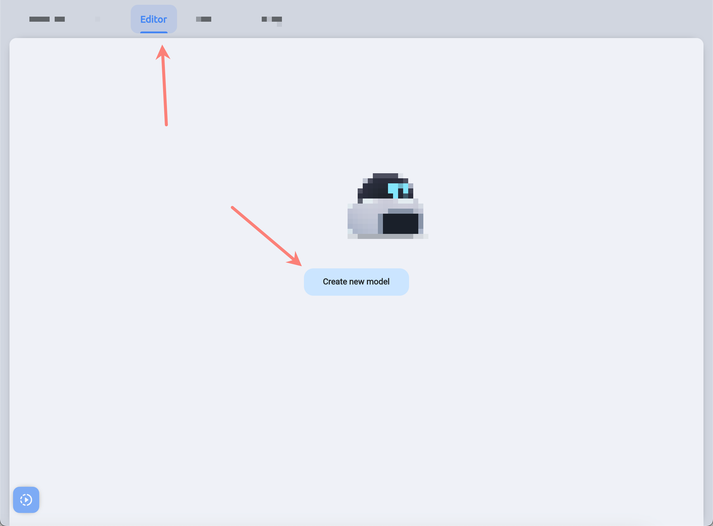

# Model

## Import

```yaml
dependencies:
  model:
    path: ../nanc/model
```

## What the Model Is?

A model is a representation of the data structure of your document. For example - you can have a table in a database storing users. In this case, to be able to manage the data in that table, you need to create a user model that reflects the fields that the documents in that table have. For example - name, age, gender and so on.

Nanc imposes a certain restriction on models - each model must have at least one [IdField](./nanc_fields#id-field). And this field must be in `String` format. The ideal candidate for this identifier value is UUID, but you can use any other value (and, looking ahead, you'll use it for a couple of special models).

Also, you can use regular incrementable identifiers at your database level as well, but at this point, the task of type conversion (from `String` to `int`) should be handled by you, at your backend or `ICollectionApi` and `IDocumentApi` level

## Creating the Model

### Code-first approach

Let's see on pretty simple model of a user:

```dart
import 'package:config/config.dart';
import 'package:nanc_fields/nanc_fields.dart';
import 'package:icons/icons.dart';
import 'package:model/model.dart';

final Model supaUser = Model(
  name: 'Users',
  id: 'users',
  icon: IconPackNames.rmx_user_3_line,
  isCollection: true,
  showInMenu: true,
  fields: [
    [
      IdField(),
    ],
    [
      StringField(name: 'Name', id: 'name', showInList: true, isRequired: true),
      StringField(name: 'Lastname', id: 'lastname', showInList: true, isRequired: true),
      NumberField(name: 'Age', id: 'age', showInList: true, isRequired: true),
    ],
  ],
);
```

As you can see from this example, to describe the model, you first need to import some additional Nanc packages:

- [Config](./config)
- [Fields](./nanc_fields)
- [Icons](./icons)
- [Model](./model)

Then - let's explain `Model`'s params:

The `name` is responsible for the name of the model visible to the human user of the CMS.

The `id` is the model identifier, unique among all your models. This identifier will also be used when interacting with your data source. For example, in this example, it is expected that there is a table named `users` in your database.

The `icon` is the string name of the icon that will be displayed in the Nanc interface, next to the model, collection or document name. You can choose any icon from a built-in set of several thousand icons. Use the [Icons](./icons) package, and the `IconPackNames` class exported from it.

You can also preview all available icons, search through them to select the appropriate one. And how to do this - you can learn in the section devoted to the package [Icons](./icons).

The `fields` - is responsible for the contents of the model. You have a large list of fields available that you can use to describe your data structures. See the [Fields](./nanc_fields) section for more information.

The `isCollection` parameter determines whether the model is a representation of a collection of documents, or refers to a single document.

#### Collection Model

This is the standard type of model, if you know that the model you are creating will be responsible for some table (or its equivalent) in which many documents will be stored - this is definitely a model-collection.

#### Solo Model

Solo models are more highly specialized representatives of your data. They do not depend on how exactly you are going to store the document this model displays. A good example of a solo model would be, for example, a feature-flags document, which can have many parameters, but they all form one single entity. It can be a whole table in the database containing just one document, or a collection (from NoSQL) with one document. Or a single JSON-type document in a special NoSQL table / collection - how it will be implemented is up to you. The approach chosen in the existing API services is to create a separate table / NoSQL collection for each Solo-model and to have one single document in that table.

> Also, solo-models have one very important limitation: the document identifier must be equal to the identifier of the model itself. For example, you created a model with identifier `feature_flags`, in which case the document must be with the same identifier.

### Interface approach

You can also create models using the interface. To do this, you need to go to the `Editor` section and click the `Create new model` button.



On this screen, you will see all the model parameters available to you for editing through code, as well as all the available fields you can add to the model.

Important clarification - changing the structure of the model (how exactly it was created is not important) - will not affect your data. However, this only applies to [API packages](./api) that come standard with Nanc. So you won't compromise the integrity of your data by accidentally or intentionally changing the structure of your model. Hence the following one conclusion - if you want to completely remove a field in your NoSQL table / collection, you need to remove that field from the model and also remove it manually in your data layer.

But you are not limited by anything in your own API implementation, and you can provide automatic deletion of anything you want (but we don't advise to do so).

Another clarification concerns the model itself - if you delete the model, it does not cause the deletion of the associated table / NoSQL collection. Again, this is about standard [API packages](./api).

### Hybrid approach

You can create a model from code and then modify it . In this case, you get a hybrid model that exists in two versions - code and a dynamic model in your database. In such models, the dynamic model is more important, so if you change a model created from code - whatever changes you make to the model from the code, those changes will not be visible until you reset that model through the interface. And once you reset the model, you can access the Code-first model again.

Also, keep in mind that you can only delete dynamic models and only reset hybrid models. Deleting Code-first models is only possible at your code level (just don't import a given model and it's as if it never existed, unless you modified it through the interface).