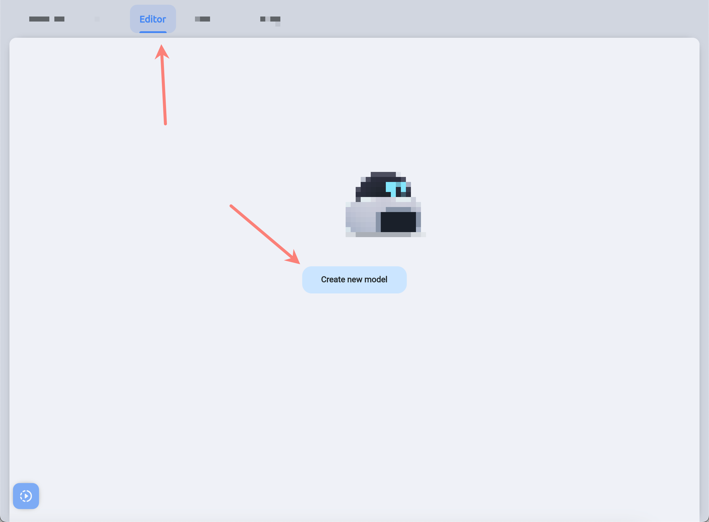

# Nanc

A key CMS package that is essential if you are going to create your Nanc instance.

## Import

Install it from [pub.dev](https://pub.dev/packages/nanc):

```yaml
dependencies:
  nanc: any
```

This package contains several modules, each of which may be useful in certain situations:
- nanc
- collection
- document
- editor
- fields
- model
- services
- ui_kit

Here are some detailed information about these modules:

## Fields

The **field** is one of the most important concepts of Nanc. Each field is responsible for storing one value in the document (string in SQL, Document in NoSQL, etc.). However, the field value can be either the simplest types, such as a string or a number, or complex ones - typed arrays, objects, or entire screens of a mobile application.

Below is a list of fields available for use in Nanc:

### Boolean field

Responsible for setting any boolean flag. Can take a default value if no value is given.

### Color field

Controls color. A handy color-picker is available to you for choosing colors and controlling transparency, and you can also set it manually in hex format.

### DateTime field

Stores time and date in ISO format `2023-06-24T00:00:00.000Z` and can also manage fields like `created_at` and `updated_at` by automatically updating the appropriate values in your data object when you do something operations with it using Nanc.

### Dynamic field

A field that is best described as "typed JSON". You can add any other field to this field (including the **Dynamic field** itself), with all the features of each of the added fields, as well as manage the sorting of these fields.

### Enum field

A field for selecting a single value from a set of values. It is assumed that this set will not be too large - up to several tens of values. Although there is no formal meaning in terms of the number of values. Each value in the set has a name and content, such as `String`.

### Font field

This field is responsible for selecting the font family. At the data level, this is a normal string of type `String`. Using this field, you can search and select any of the available **Google Fonts** fonts, and you can also add your own fonts and they will be available for selection in this field. The purpose of this field's existence is to make it easier to choose a font for text when you're creating interfaces with Nanc using the **Screen field**, however, you can think of other uses for it.

### Header field

It's not exactly a field, in the usual sense. This *field* serves as a separator between fields or as a heading for a group of fields. For example - you can group fields related to color management and give them a common title *Color palette*. This field does not affect your data in any way and will not be stored in it.

### Icon field

The field that stores the name of the icon, in the `String` format. You can choose from several thousand built-in icons, and in the future the ability to expand this list will be added. Icons, like fonts, are mostly useful when building application interfaces with Nanc.

### ID field

The only required field for any **Model**. It is of type `String` and serves as a unique identifier for each document. A document can have multiple `Id fields`, however, the first one specified will be used as the unique identifier. The preferred value for this field is UUID, however you can use any value.

### Multi selector field

A field used to display one-to-many relationships between documents. A document that has this field specified can store links to other documents. These links will be the values of this field, however, the way of storing links by many (and ourselves) will be called "relational". The API of this field assumes that you have at least three collections (tables) in your database.

**First collection** is a collection of parent documents - documents *that* will select other documents.

**Second collection** - documents *of which* parent documents will be selected as a value.

**Third collection** - stores document identifiers from **first** and **second** collections. Preferably, if the third collection will not only store two identifiers, but also have its own record identifier, which will uniquely identify the relationship of two documents (this is necessary, since not all data providers can have composite keys and select from them, therefore, for a unique single document definitions, currently, a single identifier is used.

### Number field

A field that stores a numeric value. This field supports a significant number of number types in both signed and unsigned formats:
- `bit`
- `int2`
- `int4`
- `bigint`
- `float4`
- `float8`

There is also an automatic validation for leaving the boundaries of the used type and a sign check.

### Screen field

The field responsible for creating the interface of a mobile application written in Flutter. The data type is `String`. This line can be quite large, so be careful about the limits you place on the size of this field in your document. The value of this field can be of two types - `Scrollable` and `Stack`. This field and Nanc's ability to create interfaces will be discussed in more detail in the chapter on [Server driven UI](../nui/server_driven_ui).

#### Compilation of Nui-code

Screen Field has an additional parameter `Binary Data Field ID`. You can specify it, thus extending the structure of your document.
For example, before specifying this parameter, your model had, simplistically, the following structure:

```json
{
  "id": "<uuid>",
  "ui": "<jsonb>"
}
```

Now specify a parameter with the value `ui_bin`, and you get the following structure:

```json
{
  "id": "<uuid>",
  "ui": "<jsonb>",
  "ui_bin": "<bytes>"
}
```

I will draw your attention to the fact that the actual form of this structure will differ depending on the API-implementation used - for Supabase an additional column with the type `bytea` will be created, and in Firebase there will simply be support for this field.

Now to the details - what is this field? It allows you to store "compiled" UI code in raw binary form, maximally optimized for use in the application. It's worth noting that the conversion is done only over the UI code, but not over the screen type (`Scrollable` / `Stack`).

What is the purpose of this field in the first place? If you have a large and complex screen created entirely with Nui, the time to parse it in the application can take more than `8ms`, which in turn can cause hangs when rendering such screens. The rendering of the interface from the binary format, on the other hand, is significantly faster (we are talking about several tens or even hundreds of times). Therefore, if you want to further optimize the performance of complex screens created with Nui, it makes sense to use this code format.

At the same time, this optimized format is an addition to the usual XML-based format, and is stored in a separate column (or field of the document).

And lastly - all you need to do to get compiled UI code is to specify the value of this parameter for the `ScreenField` field to any unique (within the document structure) value other than an empty string. Then - when you edit your UI code in any way, if it is correct (all UI code is correct in terms of XML syntax) a binary twin will be automatically created and saved in an additional field in your document.

### Selector field

A field that is also responsible for links between documents. But in this case it is a one-to-one or many-to-one relationship. In order for you could use this field, you must have at least two collections (tables):

**First collection** - collection of parent documents. You will add a `Selector field` to the documents of this particular collection. And when editing the documents of this particular collection, you will *choose*.

**Second collection** - a collection of child documents from which you will choose the only one for the documents of the parent collection.

The data type of this field is `String`. The preferred value is the UUID, however, it can be any unique string (which is the ID of another document). By selecting a child document in the parent document, you set the child document ID as the value of the corresponding field in the parent document.

### String field

A simple field for storing data of type `String`.

### Structured field

A field for storing an array of values of a predefined type. Or to store a single value, also of a predefined type. When you describe this field in code or create it in the interface, you will have to describe / create the type of value structure that will be stored in this field. The structure can be of any complexity and include other **Structured fields**.

## Model

### What the Model Is?

A model is a representation of the data structure of your document. For example - you can have a table in a database storing users. In this case, to be able to manage the data in that table, you need to create a user model that reflects the fields that the documents in that table have. For example - name, age, gender and so on.

Nanc imposes a certain restriction on models - each model must have at least one [IdField](./nanc_fields#id-field). And this field must be in `String` format. The ideal candidate for this identifier value is UUID, but you can use any other value (and, looking ahead, you'll use it for a couple of special models).

Also, you can use regular incrementable identifiers at your database level as well, but at this point, the task of type conversion (from `String` to `int`) should be handled by you, at your backend or `ICollectionApi` and `IDocumentApi` level

### Creating the Model

#### Code-first approach

Let's see on pretty simple model of a user:

```dart
import 'package:nanc_configuration/nanc_configuration.dart';
import 'package:nanc/fields.dart';
import 'package:nanc_icons/nanc_icons.dart';
import 'package:nanc/model.dart';

final Model supaUser = Model(
  name: 'Users',
  id: 'users',
  icon: IconPackNames.rmx_user_3_line,
  isCollection: true,
  showInMenu: true,
  fields: [
    [
      IdField(),
    ],
    [
      StringField(name: 'Name', id: 'name', showInList: true, isRequired: true),
      StringField(name: 'Lastname', id: 'lastname', showInList: true, isRequired: true),
      NumberField(name: 'Age', id: 'age', showInList: true, isRequired: true),
    ],
  ],
);
```

Then - let's explain `Model`'s params:

The `name` is responsible for the name of the model visible to the human user of the CMS.

The `id` is the model identifier, unique among all your models. This identifier will also be used when interacting with your data source. For example, in this example, it is expected that there is a table named `users` in your database.

The `icon` is the string name of the icon that will be displayed in the Nanc interface, next to the model, collection or document name. You can choose any icon from a built-in set of several thousand icons. Use the [Icons](./nanc_icons) package, and the `IconPackNames` class exported from it.

You can also preview all available icons, search through them to select the appropriate one. And how to do this - you can learn in the section devoted to the package [Icons](./nanc_icons).

The `fields` - is responsible for the contents of the model. You have a large list of fields available that you can use to describe your data structures. See the [Fields](./nanc_fields) section for more information.

The `isCollection` parameter determines whether the model is a representation of a collection of documents, or refers to a single document.

##### Collection Model

This is the standard type of model, if you know that the model you are creating will be responsible for some table (or its equivalent) in which many documents will be stored - this is definitely a model-collection.

##### Solo Model

Solo models are more highly specialized representatives of your data. They do not depend on how exactly you are going to store the document this model displays. A good example of a solo model would be, for example, a feature-flags document, which can have many parameters, but they all form one single entity. It can be a whole table in the database containing just one document, or a collection (from NoSQL) with one document. Or a single JSON-type document in a special NoSQL table / collection - how it will be implemented is up to you. The approach chosen in the existing API services is to create a separate table / NoSQL collection for each Solo-model and to have one single document in that table.

> Also, solo-models have one very important limitation: the document identifier must be equal to the identifier of the model itself. For example, you created a model with identifier `feature_flags`, in which case the document must be with the same identifier.

#### Interface approach

You can also create models using the interface. To do this, you need to go to the `Editor` section and click the `Create new model` button.



On this screen, you will see all the model parameters available to you for editing through code, as well as all the available fields you can add to the model.

Important clarification - changing the structure of the model (how exactly it was created is not important) - will not affect your data. However, this only applies to [API packages](./api) that come standard with Nanc. So you won't compromise the integrity of your data by accidentally or intentionally changing the structure of your model. Hence the following one conclusion - if you want to completely remove a field in your NoSQL table / collection, you need to remove that field from the model and also remove it manually in your data layer.

But you are not limited by anything in your own API implementation, and you can provide automatic deletion of anything you want (but we don't advise to do so).

Another clarification concerns the model itself - if you delete the model, it does not cause the deletion of the associated table / NoSQL collection. Again, this is about standard [API packages](./api).

#### Hybrid approach

You can create a model from code and then modify it . In this case, you get a hybrid model that exists in two versions - code and a dynamic model in your database. In such models, the dynamic model is more important, so if you change a model created from code - whatever changes you make to the model from the code, those changes will not be visible until you reset that model through the interface. And once you reset the model, you can access the Code-first model again.

Also, keep in mind that you can only delete dynamic models and only reset hybrid models. Deleting Code-first models is only possible at your code level (just don't import a given model and it's as if it never existed, unless you modified it through the interface).