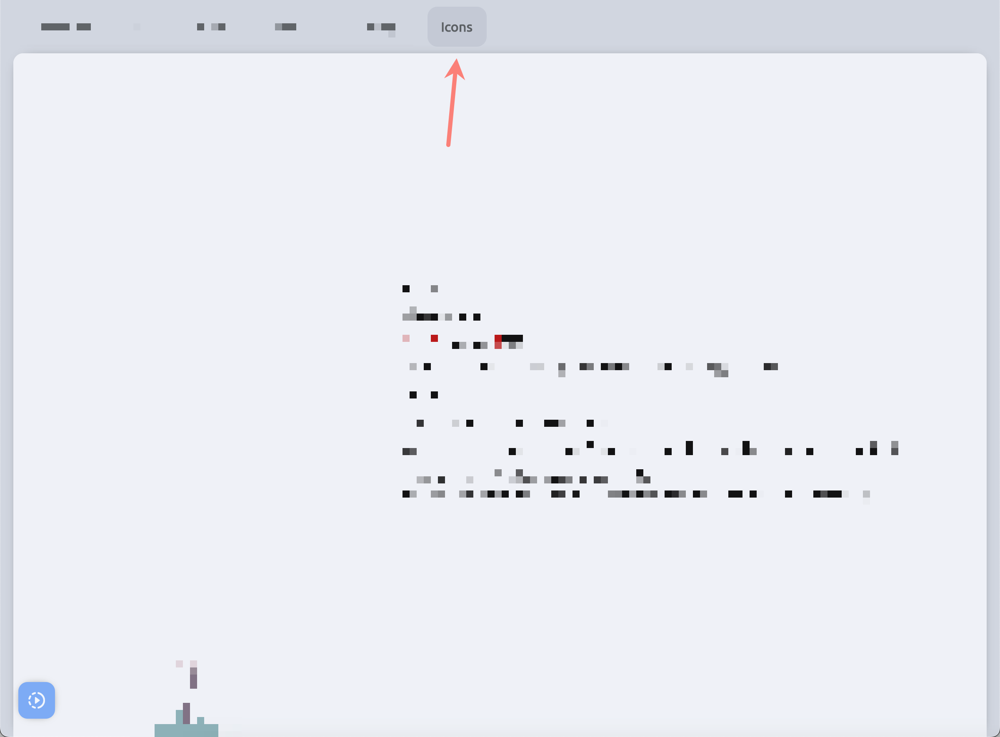
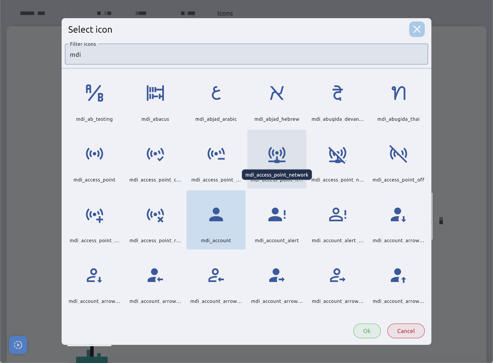

# Nanc icons

## Import

Install it from [pub.dev](https://pub.dev/packages/nanc_icons):

```yaml
dependencies:
  nanc_icons: any
```

## Using

This package gives access to all the icons that are part of Nanc, as well as their text names. Which can be useful if you are creating a Model with code.

Below are examples of using icons from the package, icon names, as well as useful factories that allow you to get an icon from the name in your mobile application:

```dart
import 'package:nanc_icons/nanc_icons.dart';

final IconData someIcon = IconPack.mdi_console;
final String someIconName = IconPackNames.mdi_console; // 'mdi_console'
final IconData someIconAgain = IconPack.fromName('mdi_console'); // IconPack.mdi_console
final IconData? someIconOrNull = IconPack.fromName('some_missed_icon_name'); // null
```

## Utils

Also, in development mode, a separate screen will be available to you, which can be accessed by clicking on the Icons menu section:





In this mode, you can click on the icon you like and its name will be copied to the clipboard. And the search box will allow you to filter the icons to find any of the ones you are interested in. This filter treats the entered value as a regular expression, which can be useful when searching.

In general, three packages are currently selected as standard icons - Material Design Icons, Fluent Design Icons and Remix Icons. Icon names in Nanc are reformatted to the snack_case register with the addition of a prefix - the shortened name of the original icon package - `mdi`, `flu` and `rmx`.

## Customizing

You are able to use your own icons as described [here](../cms_configuration.md#custom-icons).